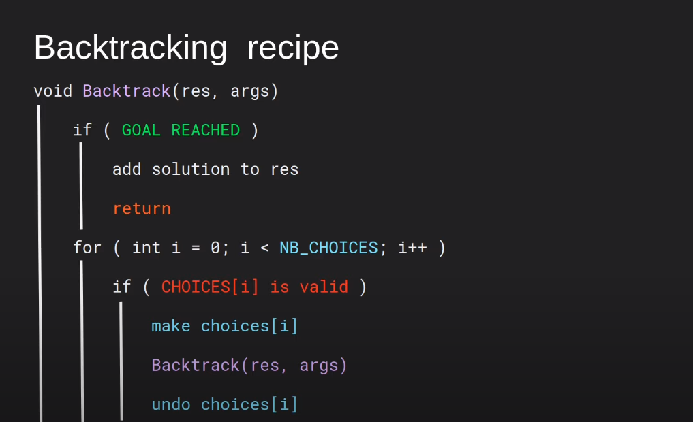

## Recursion

- https://www.interviewkickstart.com/learn/tail-recursion
- Most of the Problems we solve are using Either Tail - Recursion or Non Tail Recursion. There are other recursions such Tree Recursion(Eg : Fibonacci )
- Types of Recusion : https://www.javatpoint.com/types-of-recursion-in-c
- Use Recursion only when problem has a Tree Like Structure and requires BackTracking.

#### Tail Recursion & Non Tail Recursion

- In tail recursion, there is no other operation to perform after executing the recursive function itself; the function can directly return the result of the recursive call.
- Tail Recursion is More Preferred as Compiler Converts them to Iterative Iternally. However, Tail recursion is not readable.
  Non Tail recursion is more readable, we need to choose based on requirement.

```
  TAIL RECURSION

  public static void funcParam(int i, int sum) {
        if (i < 1) {
            System.out.println(sum);
            return;
        }
        funcParam(i - 1, sum + i);
    }
```

```
 NON TAIL RECURSION

 public static int func(int n) {
       if (n < 1)
           return 0;
       return n + func(n - 1);
   }
```
#### Tail call optimization (TCO) - Java vs C++

- Tail recursion is very similar to iteration - and usually it is transformed into an iteration by C++ Compilers.
- However java does not Convert /Optimze that because : 
In JDK classes there are a number of security sensitive methods that rely on counting stack frames between JDK library code and calling code to figure out who's calling them. So It would disturb the Mechanism if it is converted to Iterative.

Check more details here : https://stackoverflow.com/questions/53354898/tail-call-optimisation-in-java

### Best Tutorials and Blogs

Recursion Explained Easily : https://youtu.be/ngCos392W4w

## BackTracking

- In recursion while going, things/your expected calaculations/print happens while in backtracking, in coming back things happen.

  - BackTracking (Print 4 to 1) --> func(4,1)

  ```
  void func(int n , int i)
  {
      if(n<i)
          return;

      else
          func(n,i+1);
      cout<<i<<" ";
  }
  ```

  - Recursion (Print 4 to 1) --> func(4,4)

  ```
  void func(int i , int n)
  {
      if(i<1)
        return;

      else
          cout<<i<<" ";
      func(i-1,n);
  }
  ```
### BackTracking Recipe



## Useful Resources for Recursion and BackTracking

* https://leetcode.com/problems/combination-sum/solutions/16502/a-general-approach-to-backtracking-questions-in-java-subsets-permutations-combination-sum-palindrome-partitioning/
